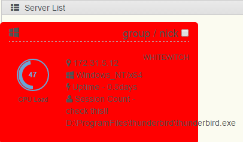
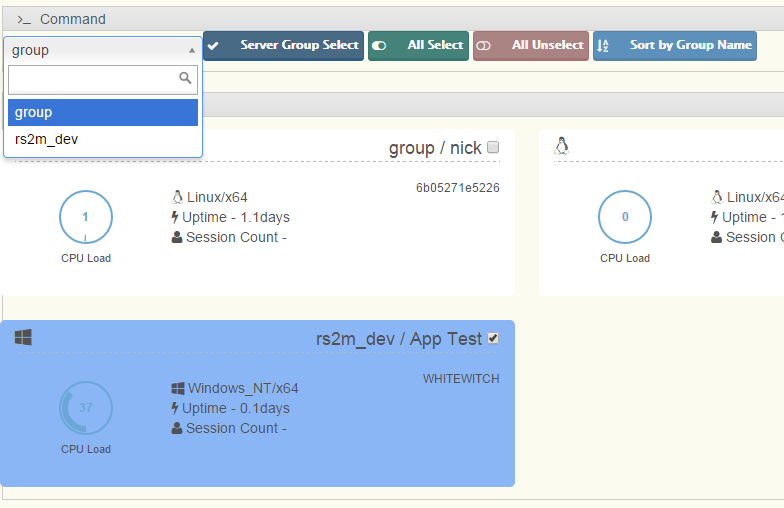

##Chapter 7. Monitoring

모니터링은 아래와 같은 종류를 지원합니다.

1) 시스템 모니터링  
CPU Load, Uptime. (필요한 모니터링 요소를 추가할 예정. 12 Goal을 참조하세요.)

 
2) 어플리케이션 모니터링  
지정한 프로세스의 정상 작동 여부. 이상이 발생하면 상태카드가 붉은색으로 변경되며, 이상이 발생한 프로세스 이름을 보여줍니다.  

 
3) 시스템에 그룹/닉네임 지정 및 정렬 및 검색 지원  

