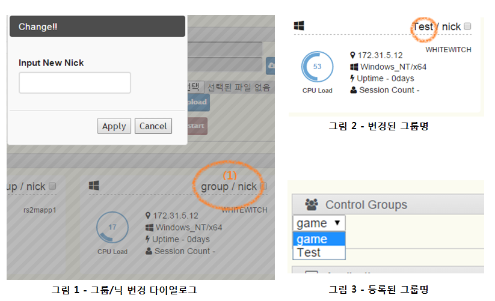

##Chapter 8. Management

1) 그룹/ 닉네임 지정  
그림1의 (1) 부분의 group 혹은 nick을 클릭하면 원하는 이름으로 변경할 수 있으며,
그림 2와 같이 반영된 결과를 볼 수 있다. 이후 그룹을 관리하는 창에서 그림 3처럼 그룹을 선택할 수 있게 됩니다.  

 
2) 관리할 어플리케이션 선정/해제  
Agent를 설치한 시스템은 Manager 서버로 정보를 보내고 이를 제공된 Web 기반의 툴에서 볼 수 있습니다. Agent가 설치된 시스템은 아래와 같은 카드 형태의 정보창에 표시되는데, 상단의 기어 아이콘을 누르면 아래와 같은 메뉴를 볼 수 있습니다.  
  
 그림 4 - 시스템 카드에서 설정 옵션 선택

이 메뉴 중 "Get Apps"를 선택하면 해당 시스템에서 가동중인 모든 프로세스 리스트를 가져옵니다.  
  
그림 5 - 어플리케이션 관리 화면

그림 5- (1)에서 콤보박스를 클릭하면 가동중인 모든 프로세스를 볼 수 있습니다.  
그림 5 -(2)에서는 아직 관리 대상이 아닌 프로세스 이므로 버튼들이 모두 비활성화 된 상태입니다.  
  
그림 6 - 특정 어플리케이션을 선정한 상태

그림 6에서 (1)번 영역을 클릭하면 선정/해제를 할 수 있으며, 선정할 경우 (2)의 영역에 해당 어플리케이션을 조정할 수 있는 버튼이 활성화 된 상태를 확인할 수 있습니다.
관리되는 어플리케이션의 경우 가동 시 설정한 옵션들을 그대로 적용하기 때문에, 별도로 옵션을 지정하지 않아도 정상적인 재시작이 가능합니다.

**주의사항**: 어플리케이션을 가동 시 실행파일이 존재하는 전체 경로를 적어 가동하는 것을 권장합니다. 만약, 해당 실행 파일이 다른 경로에서 실행 시 경로 없이 인식할 수 없다면 정상 가동이 안될 수 있습니다.

 
3) 그룹별 검색  
당신이 지정한 그룹별로 모니터 혹은 조작할 할 서버 리스트를 추릴 수 있습니다. 그림 3을 참고하세요.
 
