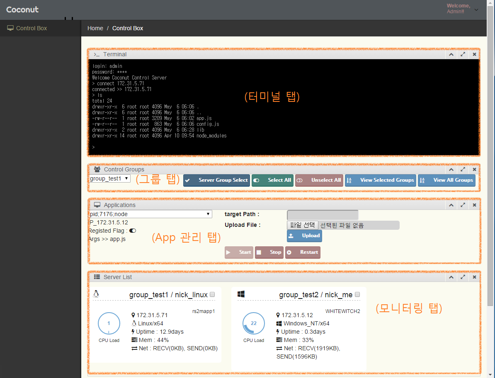

# Coconut
Service Operating System

서비스 시스템을 쉽게 관리할 수 있는 시스템입니다. 

Agent와 중앙 관리 시스템, 그리고 툴을 제공하며, 주요 기능은 아래와 같습니다.

(터미널 탭) : 이 창을 통해 각 서버로 접속하여 상세한 컨트롤을 할 수 있습니다.

(그룹 탭) : 모니터링 혹은 명령 전달을 특정 그룹별에 전달하기 위해 서버를 정렬하거나 선택/해제를 할 수 있습니다.

(App 관리 탭) : 가동중인 프로세스 중 특정한 어플리케이션을 지정하여 시작/중단/재시작을 지시할 수 있으며, 
특정 서버 혹은 그룹에 지정한 파일을 전달할 수 있습니다. (6월 업데이트에서 원격 저장소에서 다운받는 기능이 추가될 예정입니다.)

(모니터링 탭) : 등록된 서버들의 리소스를 모니터링할 수 있는 탭으로, 특정한 리소스가 한계에 달하거나, 관리 대상의 어플에 문제가 발생하면 붉은색으로 표기됩니다.

* 개발 진행은 https://trello.com/b/LYG2yy6n/coconut 에서 확인 가능합니다.
